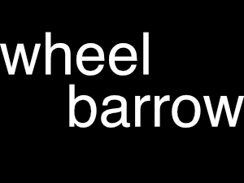

  

<h1 align="center">
  Bluegold
</h1>

## Description

An online portfolio/shop for a maker and educator.

## Docs

Coming soon

## Requirements

Gulp process is currently using node v11.6.0 (npm v6.9.0).

Run 'npm install' from within the wp-content/themes/gulp-dev directory, then run 'gulp' for browser-sync and asset compilation.

## Changelog

= 1.0 - August 2020 =

- Initial release

## Credits

- Based on Underscores https://underscores.me/, (C) 2012-2017 Automattic, Inc., [GPLv2 or later](https://www.gnu.org/licenses/gpl-2.0.html)
- normalize.css https://necolas.github.io/normalize.css/, (C) 2012-2016 Nicolas Gallagher and Jonathan Neal, [MIT](https://opensource.org/licenses/MIT)
